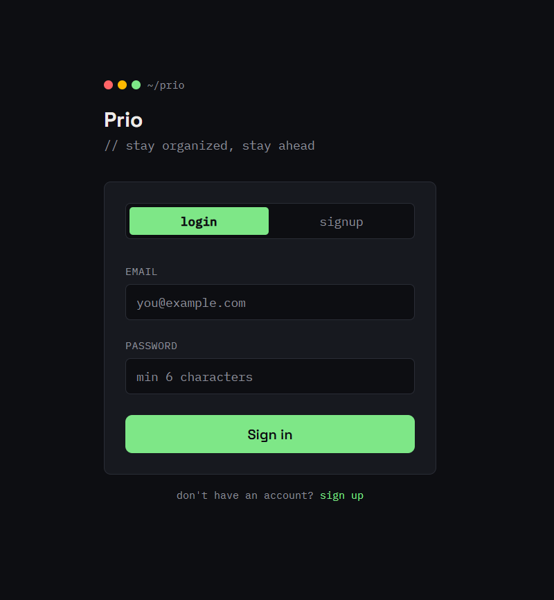

# Prio — Task Manager

A full-stack task management app with user authentication, priority tracking, deadline-based grouping, subtasks, and a live dashboard — built to go beyond basic CRUD.

**Live app:** [prio-app-psi.vercel.app](https://prio-app-psi.vercel.app/)

> ⚠️ The backend runs on Render's free tier, which spins down after inactivity. The first request after idle time may take 30–60 seconds to respond. Subsequent requests are fast.

---

## Screenshots

### Login / Signup


### Dashboard — Dark Mode


### Dashboard — Light Mode


### Mobile View


### Add Task


### Subtasks with Progress Tracking


---

## Features

- **User authentication** — secure signup/login with JWT tokens, per-user task isolation
- **Smart task grouping** — tasks automatically sorted into Overdue, Today, Upcoming, and Someday based on deadline
- **Subtasks with progress bars** — break tasks into steps, track completion percentage per task
- **Priority & category system** — High/Medium/Low priority, Work/Personal/Study categories, color-coded throughout
- **Search & multi-filter** — filter by category, priority, and completion status simultaneously
- **Dark/light mode** — persisted across sessions via localStorage
- **Live dashboard** — completion stats, category/priority breakdowns, overall progress bar
- **Overdue alerts** — header badge shows overdue task count at a glance
- **Smooth animations** — Framer Motion transitions on add/delete/expand

---

## Tech Stack

| Layer | Technology |
|---|---|
| Frontend | React, Vite, Tailwind CSS, Framer Motion |
| Backend | FastAPI (Python) |
| Database | PostgreSQL (hosted on Neon) |
| Auth | JWT (python-jose) + bcrypt password hashing |
| ORM | SQLAlchemy |
| Deployment | Vercel (frontend), Render (backend) |

---

## Architecture

- JWT-based authentication — tokens stored in localStorage, sent via Authorization header
- RESTful API with full CRUD for tasks and subtasks
- Tasks scoped to authenticated users — no data leakage between accounts
- CORS-secured cross-origin requests between frontend and backend
- Environment-based config — no secrets committed to source

---

## Local Setup

### Backend

```bash
cd backend
python -m venv venv
source venv/bin/activate   # Windows: venv\Scripts\activate
pip install -r requirements.txt
```

Create `backend/.env`:

```bash
uvicorn main:app --reload
```

Backend runs at `http://localhost:8000` — API docs at `http://localhost:8000/docs`

### Frontend

```bash
cd frontend
npm install
npm run dev
```

Frontend runs at `http://localhost:5173`

---

## API Endpoints

### Auth
| Method | Endpoint | Description |
|---|---|---|
| POST | `/api/auth/signup` | Create a new account |
| POST | `/api/auth/login` | Login and receive JWT token |
| GET | `/api/auth/me` | Get current user info |

### Tasks
| Method | Endpoint | Description |
|---|---|---|
| GET | `/api/tasks/` | List tasks (supports search, category, priority, completed filters) |
| POST | `/api/tasks/` | Create a task |
| PUT | `/api/tasks/{id}` | Update a task |
| DELETE | `/api/tasks/{id}` | Delete a task |
| GET | `/api/tasks/stats/summary` | Dashboard statistics |
| POST | `/api/tasks/{id}/subtasks` | Add a subtask |
| PUT | `/api/tasks/{id}/subtasks/{subtask_id}` | Toggle subtask completion |
| DELETE | `/api/tasks/{id}/subtasks/{subtask_id}` | Delete a subtask |

---

## Known Limitations

- Free-tier backend hosting causes cold-start delay of 30–60s after inactivity
- No email/push notifications for approaching deadlines (planned)

---

## License

MIT